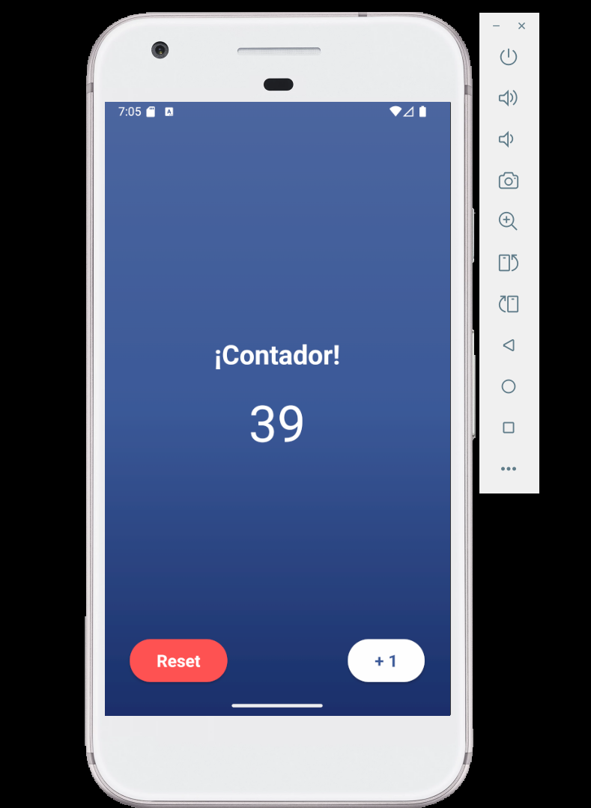

# Counter App


Esta es una aplicación simple de contador creada con **React Native** y **Expo**.

## Características

- Muestra un número en pantalla que puedes incrementar.
- Botón para incrementar el contador.
- Botón para resetear el contador a cero.
- Interfaz moderna con fondo degradado.
- Botones posicionados en las esquinas inferiores para fácil acceso.
- Botón reutilizable (`CustomButton`) para mantener el código limpio y escalable.
- Lógica del contador encapsulada en un hook personalizado (`useCounter`).
- Componentes de UI separados para la visualización (`CounterDisplay`) y los controles (`CounterControls`).
- Estilos modularizados en un archivo dedicado (`App.styles.ts`).
- Iconos personalizados en la carpeta `assets`.


## Captura de pantalla



## Instalación y ejecución

1. Clona el repositorio:
   ```sh
   git clone https://github.com/pierotticastillo/counter-app.git
   cd counter-app
   ```

2. Instala las dependencias usando **pnpm**:
   ```sh
   pnpm install
   ```

3. Instala las dependencias de Expo (si es necesario):
   ```sh
   npx expo install expo-linear-gradient
   ```

4. Inicia la app:
   ```sh
   npx expo start -c
   ```

5. Escanea el código QR con la app **Expo Go** en tu dispositivo móvil o ejecuta en un emulador.

## Estructura del proyecto

```
counter-app/
├── App.tsx
├── App.styles.ts
├── hooks/
│   └── useCounter.ts
├── components/
│   ├── CustomButton.tsx
│   ├── CounterDisplay.tsx
│   └── CounterControls.tsx
├── assets/
│   ├── adaptive-icon.png
│   ├── favicon.png
│   ├── icon.png
│   └── splash-icon.png
├── package.json
└── ...
```

## Personalización

Puedes modificar los colores, el diseño o agregar nuevas funcionalidades fácilmente gracias a la estructura modular del código.

---

¡Disfruta programando y personalizando!


## 📄 Licencia

Este proyecto está bajo la Licencia MIT. Consulta el archivo [LICENSE](./LICENSE) para más detalles.
